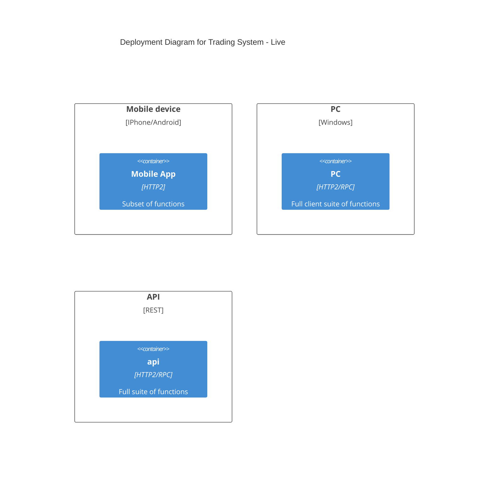
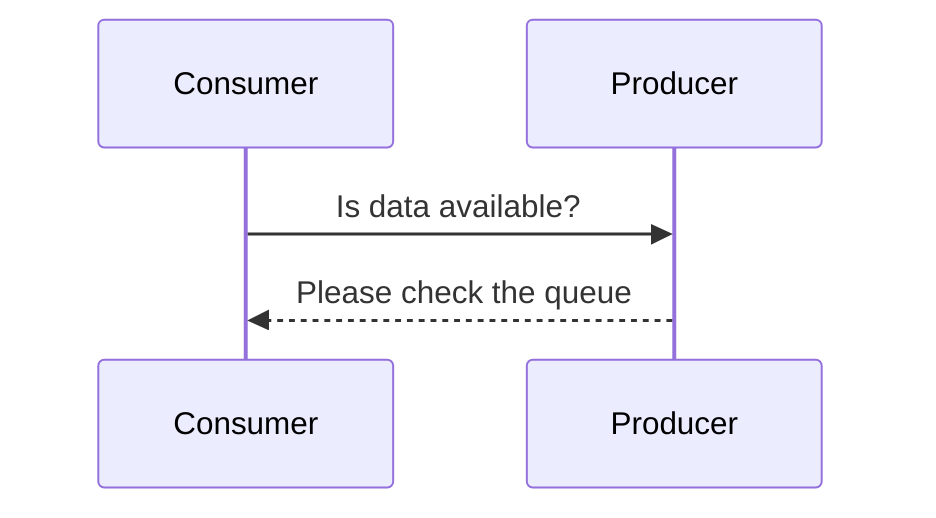
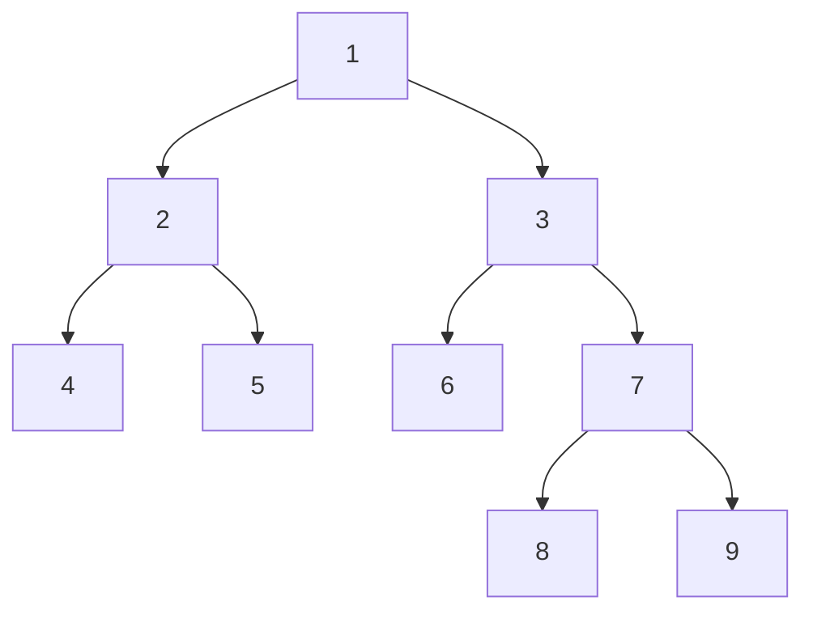

# mermaid_fun
Some sample mermaid and other github markdown






```stl
solid cube
  facet normal 1.0 0.0 0.0
    outer loop
      vertex 1.0 0.0 0.0
      vertex 1.0 1.0 0.0
      vertex 1.0 0.0 1.0
    endloop
  endfacet
  facet normal 1.0 0.0 0.0
    outer loop
      vertex 1.0 1.0 0.0
      vertex 1.0 1.0 1.0
      vertex 1.0 0.0 1.0
    endloop
  endfacet
  facet normal -1.0 0.0 0.0
    outer loop
      vertex 0.0 0.0 0.0
      vertex 0.0 0.0 1.0
      vertex 0.0 1.0 0.0
    endloop
  endfacet
  facet normal -1.0 0.0 0.0
    outer loop
      vertex 0.0 0.0 1.0
      vertex 0.0 1.0 1.0
      vertex 0.0 1.0 0.0
    endloop
  endfacet
  facet normal 0.0 1.0 0.0
    outer loop
      vertex 0.0 1.0 0.0
      vertex 0.0 1.0 1.0
      vertex 1.0 1.0 0.0
    endloop
  endfacet
  facet normal 0.0 1.0 0.0
    outer loop
      vertex 1.0 1.0 0.0
      vertex 0.0 1.0 1.0
      vertex 1.0 1.0 1.0
    endloop
  endfacet
  
  facet normal 0.0 -1.0 0.0
    outer loop
      vertex 0.0 0.0 0.0
      vertex 1.0 0.0 0.0
      vertex 0.0 0.0 1.0
    endloop
  endfacet
  facet normal 0.0 -1.0 0.0
    outer loop
      vertex 1.0 0.0 0.0
      vertex 1.0 0.0 1.0
      vertex 0.0 0.0 1.0
    endloop
  endfacet
  
  facet normal 0.0 0.0 1.0
    outer loop
      vertex 0.0 0.0 1.0
      vertex 1.0 0.0 1.0
      vertex 0.0 1.0 1.0
    endloop
  endfacet
  
  facet normal 0.0 0.0 1.0
    outer loop
      vertex 1.0 0.0 1.0
      vertex 1.0 1.0 1.0
      vertex 0.0 1.0 1.0
    endloop
  endfacet
  
  facet normal 0.0 0.0 -1.0
    outer loop
      vertex 0.0 0.0 0.0
      vertex 0.0 1.0 0.0
      vertex 1.0 0.0 0.0
    endloop
  endfacet
  
  facet normal 0.0 0.0 -1.0
    outer loop
      vertex 0.0 1.0 0.0
      vertex 1.0 1.0 0.0
      vertex 1.0 0.0 0.0
    endloop
  endfacet
  
  endsolid
  
  solid single_face
    facet normal 1.0 0.0 0.0
      outer loop
        vertex 5.0 0.0 0.0
        vertex 5.0 1.0 0.0
        vertex 5.0 0.0 1.0
      endloop
    endfacet
    facet normal 1.0 0.0 0.0
      outer loop
        vertex 5.0 1.0 0.0
        vertex 5.0 1.0 1.0
        vertex 5.0 0.0 1.0
      endloop
    endfacet
  endsolid 
```
